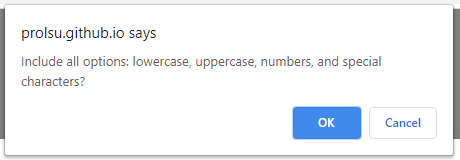
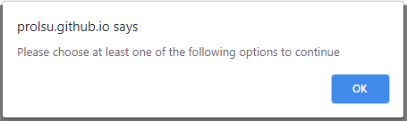
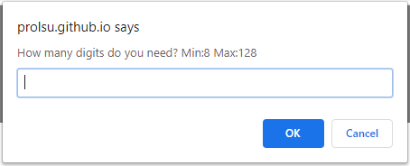
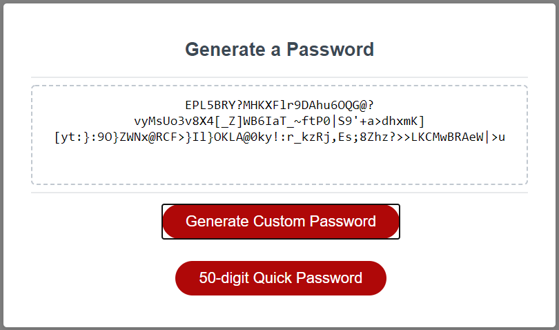
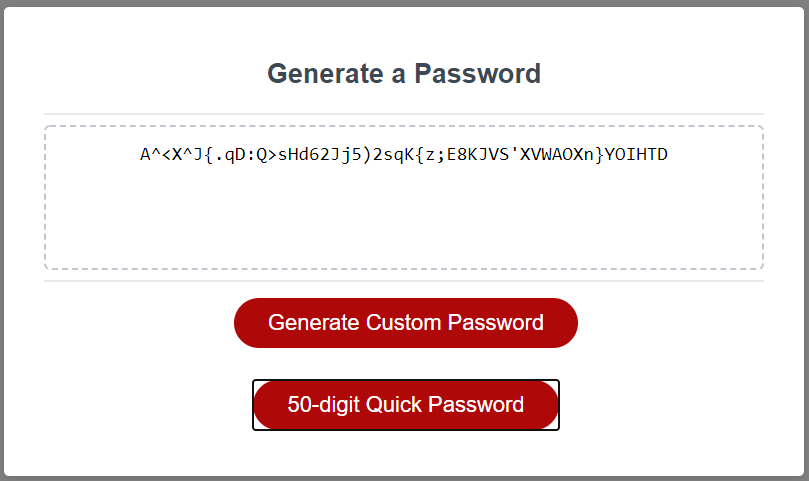

# Password Generator
- - -

## At a Glance

The following application allows the user to generate a multi-character password that is unique everytime.
- - -

## Key Points

* The character types are:
  * Lowercase
  * Uppercase
  * Numeric
  * Special characters

* Password limit restricted to 8 to 128 characters 
- - -
## Breaking it down

The user is presented with two buttons to generate the password.
- - -
### Custom-password button:

This button will allow them to customize their password. Once clicked, they are prompet to choose to select all character types before requesting the number of characters needed.
This becomes a quicker option to generate a custumized password without having to select each of the character types.

If the user chooses to disregard this option, they are then prompted to choose one of the four character types followed again by the number of characters needed.

For both instances, the number of characters expected must be between 8 and 128. If the box is left empy or a letter is entered, the user will be alerted to enter a number.

The result for customizable options will be presented inside the box on the screen.

- - -
### Quick-password button:

This button will generate a 50-digit multi-character password everytime it is pressed.
The user is not requiered to select a particular criteria, so it becomes a faster way to create a unique password everytime.

- - - 
